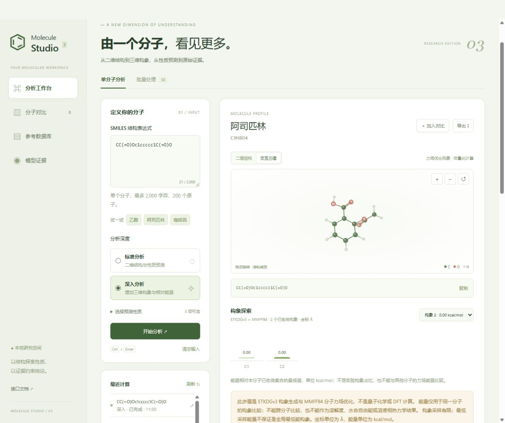

# Molecule Studio V3 · 本地分子研究工作台

V3 是可独立运行的 FastAPI 项目：本地多性质机器学习、可取消的三维构象计算、实验参考检索和 QM9 计算参考库，共用一个中文网页。源代码、已训练模型、数据库、原始快照、测试与报告都在本包内。无需付费 API 密钥，正常预测不会上传输入分子。

## 报告与验收入口

- [项目报告 PDF（9 页）](docs/V3_项目报告.pdf) · [可编辑 Word 报告](docs/V3_项目报告.docx)
- [题目要求与验收说明](ACCEPTANCE.md)
- [自动测试记录](reports/automated_summary.json)：86 项通过；[真实 HTTP 验收](reports/live_acceptance.json)：65 项断言通过；[浏览器操作验收](reports/browser-qa.json)：23 项通过。
- [数据来源与许可](data/SOURCES.md) · [MIT 许可证](LICENSE) · [第三方声明](NOTICE.md)



```powershell
git clone https://github.com/songsiyi2006-chem/molecule-studio-v3.git
cd molecule-studio-v3
```

GitHub 仓库用于分发代码和报告；运行网页与 API 需要按下方步骤在自己的电脑启动服务。

## 快速启动

在已经配置好环境的当前电脑，双击 `start.bat`，或 PowerShell 执行：

```powershell
.\start.ps1
```

默认浏览器地址 **http://127.0.0.1:8003/**；交互 API 文档 **http://127.0.0.1:8003/docs**。终端需保持运行；按 Ctrl+C 停止。端口冲突时使用 `.\start.ps1 -Port 8004`。

新电脑需安装 Python 3.12，在解压目录执行：

```powershell
py -3.12 -m venv .venv
.\.venv\Scripts\python.exe -m pip install -r requirements.txt
.\start.ps1
```

环境目录不会打包。模型使用固定 RDKit/scikit-learn 版本，版本不匹配时拒绝加载；不要从旧电脑直接复制 `.venv`。本次验证复用了这台电脑的已装科学计算依赖，并验证了解压后运行，未声称完成全新操作系统安装。首次安装依赖需要网络；包内数据、模型及网页运行不需要外部网络。macOS/Linux 可按相应 venv 命令安装后运行 `python run.py --port 8003 --open`，本次实际验收平台为 Windows。

## 日常使用

1. 在分析工作台输入 SMILES，或点击乙醇、阿司匹林、咖啡因示例。选择“标准分析”得到二维结构、描述符和三个性质的模型估计。
2. 选择“深入分析”增加真实 ETKDGv3 + MMFF94 构象计算。三维图可旋转、缩放、切换构象；可导出 SDF。计算按真实阶段显示状态，支持取消。复杂输入可能跳过三维步骤或触发 20 秒子进程时限。
3. 将最多四个结果加入分子对比。只并排比较同定义、同单位的性质，不比较不同分子的力场绝对能量。
4. 批量页支持最多 50 行 SMILES，也可导入包含 SMILES 列的 CSV；每行独立返回结果或错误。批量不计算三维构象。
5. 实验数据库支持文本、精确结构和 Morgan/Tanimoto 相似检索；可按来源和性质筛选。QM9 作为单独的“量化计算参考”页签，支持精确分子式、SMILES、常见别名或 `gdb_1` 等来源编号。
6. 模型证据页展示交付模型的实际测试结果和校准信息。“最近计算”可重新打开完成的分析。历史只在本地保存。

## 结果的四种来源

| 类型 | 实现与含义 |
|---|---|
| 模型预测 | logS、pH 7.4 下的 logD、水合自由能三个独立回归任务，带名义 90% 校准区间 |
| 结构计算 | RDKit 二维描述符、ETKDGv3 构象及 MMFF94 相对能量/形状描述符 |
| 实验参考 | ESOL、AqSolDB、Lipophilicity、FreeSolv 的 14685 条观测、12843 个规范结构 |
| 量化计算参考 | QM9 原有 B3LYP/6-31G(2df,p) 计算的 130831 条记录、130744 个规范结构；不是本次运行的 DFT |

三个预测任务与五个 QM9 查询字段不能合称“八个训练模型”。QM9 没有被加入实测性质训练数据。跨数据库存在重复结构，两个库的结构数不可简单相加成为独立分子总数。

logS 单位是 log10(mol/L)，logD 为 pH 7.4 的 log10(D)，水合自由能单位 kcal/mol。RDKit LogP 与 logD 不同；水合自由能也不等于溶解度。QM9 的 HOMO/LUMO/gap 已从 Hartree 转为 eV，偶极矩为 Debye，极化率为 Bohr³。完整来源、许可证、换算和排除规则见 `data/SOURCES.md`。

## API

| 方法与路径 | 用途 |
|---|---|
| GET `/health`、`/model-info` | 模型/数据库状态，模型评估与元信息 |
| POST `/predict` | 同步返回多性质结果，保留题面规定的 valid、molecule、logS_prediction、descriptor 字段 |
| POST `/predict/batch` | 最多 50 个输入，逐行结果 |
| POST `/analyses` | 异步标准/深入分析，立即返回 202 与任务 ID |
| GET `/analyses/{id}` | 阶段、耗时、最终结果或错误 |
| DELETE `/analyses/{id}` | 取消当前任务，停止对应三维子进程 |
| GET `/analyses` | 最近任务历史 |
| GET `/analyses/{id}/conformers.sdf` | 已完成的收敛构象合集 |
| GET `/database/advanced` | 实验性质库文本/精确/相似检索及来源筛选 |
| GET `/database/detail/{id}` | 各来源原始观测及差异范围 |
| GET `/quantum/stats`、`/quantum/search` | 独立 QM9 计算参考库 |
| POST `/assignment/predict` | 题目算法兼容：根目录 model.pkl，纯 ESOL 随机森林，九项描述符 |

PowerShell 示例：

```powershell
$body = @{smiles='CCO';mode='deep'} | ConvertTo-Json
$job = Invoke-RestMethod -Method Post -Uri 'http://127.0.0.1:8003/analyses' -ContentType 'application/json' -Body $body
Invoke-RestMethod ('http://127.0.0.1:8003/analyses/' + $job.id)
```

`docs/API_EXAMPLES.json` 给出字段结构，示例数值明确为示意。主模型是扩展实现，纯 ESOL 兼容模型是独立验收入口；不能把两者的指标互换。API 是本地 HTTP 服务，并非公网托管。当前没有账号系统、密钥鉴权或生产级负载验收，默认只绑定 127.0.0.1。

## 交付模型的实际成绩

219 项固定二维描述符与 2048 位 Morgan 指纹用于七个预先定义的候选。验证集选择最多两个成员及固定非负权重，之后重拟合训练与验证数据；校准和测试标签不参与选模。

| 性质 | 固定测试数 | RMSE | MAE | 名义 90% 区间的实际覆盖 |
|---|---:|---:|---:|---:|
| 水溶解度 logS | 224 | 0.825611 | 0.637439 | 95.98% |
| logD，pH 7.4 | 615 | 0.726950 | 0.551399 | 85.85% |
| 水合自由能，kcal/mol | 78 | 1.342369 | 1.096688 | 100.00% |

同一固定测试集上，前两个目标的误差下降，水合自由能略有增加。logD 区间未达到名义 90% 覆盖；水合区间平均全宽 12.17 kcal/mol，且校准样本仅 46 个，100% 覆盖不代表高精度。这些测试数据此前已在开发中查看，并非新的前瞻外部验证。各性质单位不同，不能横向比较 RMSE。

## 离线重建与验收

```powershell
# 科学模型重新训练：候选协议固定，测试标签不用于选择
.\start.ps1 -Train
# 从包内原始快照重建实验库、指纹索引和 QM9 库
.\start.ps1 -PrepareData
# 如只需重建索引与 QM9，也可单独运行（不必与上一命令重复）
.\.venv\Scripts\python.exe scripts/build_catalog.py
# 单独重新训练题目兼容模型，报告写入 reports/assignment
.\.venv\Scripts\python.exe scripts/train_assignment.py
# 全部自动验收
.\start.ps1 -Test
```

使用 Conda 的环境时通过 `start.ps1` 启动可补齐 DLL 路径；直接运行 Python 脚本需激活该环境。重新训练是离线开发任务，可能需要数分钟至更长，不是网页单次推理耗时。原始文件的 SHA-256 会被验证；模型与校准数据的隔离、预测重算和报告哈希在测试中检查。

主要证据：`reports/model_catalog.json`、三个性质子目录的 `candidate_validation.csv` / `split_manifest.csv` / `test_predictions.csv` / `metrics.json`、`reports/catalog_audit.json`、最终自动测试与浏览器记录，以及 `PACKAGE_MANIFEST.json`。打包脚本会校验 ZIP CRC、全部解压文件哈希并在解压目录执行真实 API/模型/三维烟雾测试。

## 范围与维护

- 三个模型只覆盖普通理化性质；不提供毒性、靶点活性、药效或临床判断。
- 内部骨架留出评估不是独立外部验证。模型区间基于校准残差，名义 90% 不保证任意分子的覆盖；成员分歧不等于校准误差。
- 当前未建模温度、晶型和酸碱微态。明显分布外结构不显示预测值；通过适用范围筛查也不保证预测正确。
- 三维采样最多请求 16 个构象，几何去重后可能少于 16 个；只将收敛构象用于三维展示、相对能量和 SDF。MMFF94 属于分子力场，不是量子化学，不直接修正 logS/logD 模型。
- 一个服务进程使用单分析 worker、最多八个排队任务，保留最近一百个终态任务；前端/健康检查保持可用。不要对同一工作目录同时启动多个服务实例。
- 个人历史保存在 `data/workspace.sqlite`，构象附件保存在 `data/workspace_artifacts`。交付包不包含本机历史记录。报告、模型和原始数据保留在各自目录中。
- 模型 pickle 仅加载交付的固定文件；网络接口不接受用户上传的模型路径。

## 许可证

原创软件与原创说明文档采用 [MIT License](LICENSE)。第三方数据集、依赖和引用材料保留各自的许可条件，详见 [NOTICE.md](NOTICE.md) 与 [data/SOURCES.md](data/SOURCES.md)。
